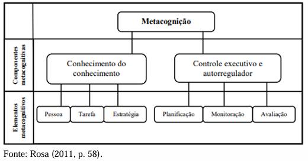
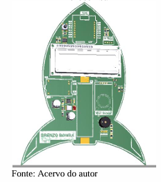
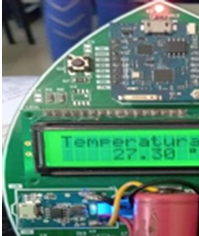
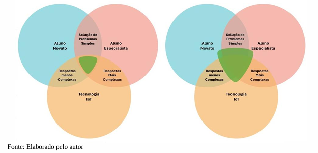

# 🛰️ Brezobomba Labs: IoT & Metacognição Ambiental

O **Brezobomba** é um ecossistema de hardware e software projetado para atuar como um dispositivo didático intuitivo focado na mediação pedagógica transdisciplinar. Desenvolvido ao longo de mais de uma década, o projeto une a **Internet das Coisas (IoT)** ao ensino de ciências, servindo de base empírica para pesquisas de Mestrado e Tese de Doutorado em Ensino de Ciências e Matemática (UPF).

O objetivo central do artefato é capturar dados ambientais físicos reais para mitigar discursos superficiais ou genéricos em sala de aula, promovendo a transição dos alunos de um perfil cognitivo "novato" para um perfil "expert" na resolução de problemas complexos.

---

## 🔬 Fundamentação Teórica & Científica
O ecossistema não se limita à execução de tarefas de hardware; sua arquitetura de aplicação foi desenhada sob três pilares científicos:
1. **Metacognição (John Flavell / Ann Brown):** Estímulo à tomada de consciência e autorregulação do aprendizado através dos processos de *planificação, monitoramento e avaliação*.
2. **Níveis de Expertise (Michelene Chi):** Metodologia orientada a fazer o aluno estruturar representações mentais profundas antes de propor soluções, mimetizando o comportamento de bons solucionadores de problemas (experts).
3. **Educação Ambiental Crítica (Lei 9.795/99 & ODS 3):** Contextualização do aprendizado partindo da realidade cotidiana do estudante, alinhado à meta 3.9 da ONU para redução de impactos por poluição do ar.

*Figura 1: Representação dos componentes e elementos metacognitivos adaptados na pesquisa.*

---

## 🛠️ Arquitetura do Sistema e Componentes
O ecossistema é composto por uma arquitetura embarcada híbrida de baixo custo e alta replicabilidade:

*   **Unidade de Processamento:** Raspberry Pi executando ambiente Linux embarcado.
*   **Sensoriamento:** Matriz de sensores ambientais para monitoramento ativo da qualidade do ar (incluindo variáveis como temperatura, umidade e presença de gases/CO₂).
*   **Interface Física:** Display/Monitor integrado ao protótipo e botões dedicados para conexão de rede simplificada.
*   **Camada de Aplicação:** Integração nativa de software para sistemas Android e exportação de dados automatizada via protocolo web para visualização remota em tempo real.

  
  

*Figura 2: Modelagem tridimensional e protótipo físico finalizado do dispositivo IoT.*

---

## 📊 Aplicação e Validação Metodológica
A validação de impacto do dispositivo foi realizada sob uma abordagem de **investigação qualitativa de intervenção pedagógica** no Colégio Estadual Eulina Braga, em Passo Fundo (RS):
*   **Amostra:** Grupos de estudantes do Ensino Fundamental avaliados de forma colaborativa.
*   **Coleta de Dados:** Diários de bordo analíticos, fichas de observação sistemática e análise de desenhos livres metacognitivos.
*   **Tratamento Analítico:** Os dados e interações verbais gerados pelo uso do hardware foram validados à luz da *Análise de Conteúdo de Laurence Bardin*.

*Figura 3: Modelagem comparativa dos cenários de aplicação de tecnologia IoT em sala de aula mediada por estratégias metacognitivas.*

Os resultados científicos demonstraram que a mediação física do dispositivo IoT gerou pensamentos sofisticados de hipóteses complexas, ampliando o poder de autonomia e decisão do estudante sobre o seu próprio processo de aprendizagem.

---

## 📂 Organização do Repositório
*   `/hardware`: Modelos de prototipagem 3D, esquemáticos da placa e lista completa de componentes eletrônicos.
*   `/source`: Código-fonte para o firmware do Raspberry Pi, scripts de tratamento de dados e interface Android.
*   `/educational-product`: Sequência didática homologada, questionários de perfil metacognitivo e manuais de suporte docente.

---

## 📜 Publicações Associadas e Direitos
*   **Tese de Doutorado:** *O Ensino da Qualidade do Ar Mediado pela Tecnologia IoT sob a Perspectiva da Metacognição* (PPGECM / UPF, 2025).
*   **Disponibilidade:** Produto educacional registrado e disponível publicamente via plataforma **CAPES / Educapes**.

---

